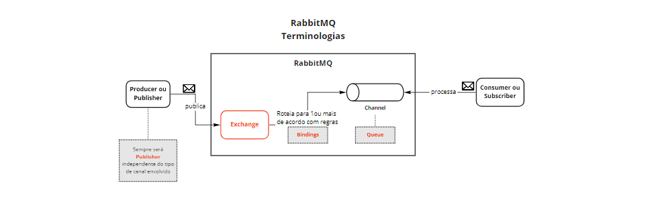
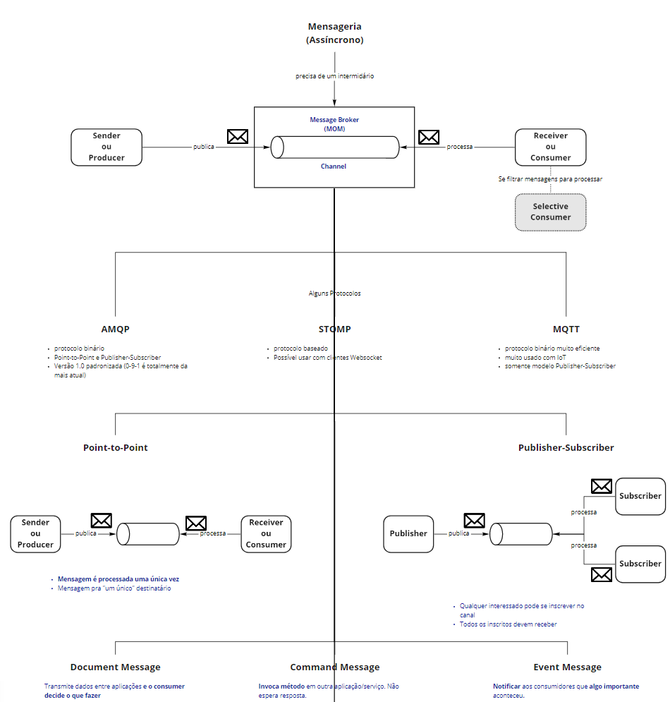
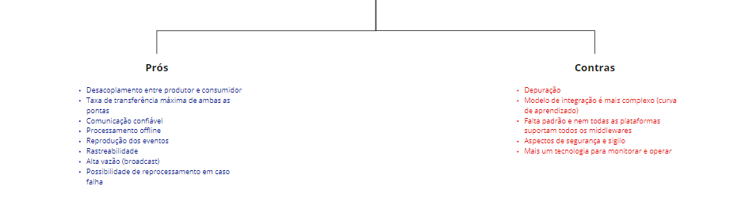

# RabbitMQ - Mensageria

<b>AMQP</b> = protocolo binário, Point-to-Point e Publish-Subscriber. 

<b>STOM</b> = possível usar com clientes Websocket 

<b>MQTT</b> = protocolo binário muito eficiente, muito usado com IoT, somente modelo Publisher-Subscriber. 

<b>Point-to-Point</b> = Mensagem é processada uma única vez. Mensagem pra "um único" destinatário.

<b>Publish-Subscriber</b> = Qualquer interessado pode se inscrever no canal. Todos os inscritos devem receber.

<b>Document Message</b> = Transmite dados entre aplicações e o consumer decide o que fazer.

<b>Command Message</b> = Invoca método em outra aplicação/serviço e não espera resposta.

<b>Event Message</b> = Notificar aos consumidores algo importante aconteceu.

<b>Domain Events</b> = Alteração significativa em termos de NEGÓCIO. É gerado por uma Agregado em decorrência de um comando (uma operação em trome de NEGÓCIO).

<b>Event-Driven Microservices</b> = usa Domain Events para integração.

<b>Event-Streaming</b> = é uma forma de capturar e análisar e responder aos eventos em tempo real, garante o fluxo continuo e interpretação dos dados pra quer as informações esteja no lugar certo na hora certa.

-------------------------------------------------------------------------------------------------------

Publish -> publica em uma EXCHANGE -> que vai rotiar isso para uma -> QUEUE que vai ser consumida pelo um -> CONSUMIDOR.

<b>EXCHANGE:</b> Tem a tarefa de receber a mensagem enviada pelo produtor e encaminha para a fila destinada pelo produtor
para ser consumida pelo consumidor.

         -- O produtor envia uma mensagem e é interceptada por uma EXCHANGE que vai encaminhar essa mensagem para uma filae a QUEUE vai amarzenar essa mensagem em fila até o consumidor de fato consuma ela --

          Por quer, ela vai ficar amarzenada ? o consumidor pode está offline, ou pode está fazendo outra tarefa e ele não pode está consumindo essa mensagem em realtime.
          Então ele vai esperar ali, e quando o consumidor estiver pronto para consumila essa mensagem irá ser processada. 

<b>Deadletter</b>: Para controle de erro (caso o producer ou o consumer der algum tipo de erro, essa mensagem irá cair na Deadletter e podemos reprocessar a mensagem).

<b>Queues (Filas)</b>: As queues são as filas responsáveis por armazenar as mensagens que serão distribuídas para o canal de saída.

<b>Bindings (Vínculos)</b>: Os bindings são caminhos de entrega das mensagens, o exchange utiliza-os para identificar em qual queue a mensagem será entregue.

<b>Exchanges (Permutadores)</b>: Os exchanges são os responsáveis por distribuir as mensagens para as queues, utilizando os bindings para identificar a fila de destino daquela mensagem específica.

